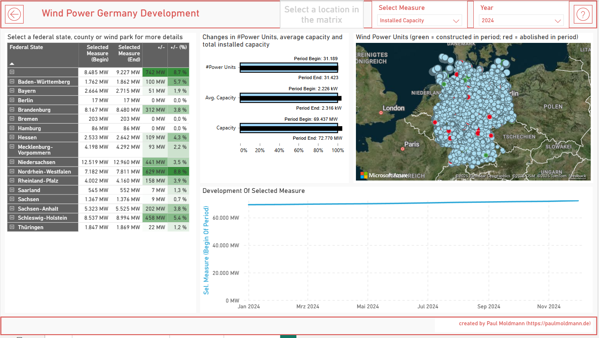
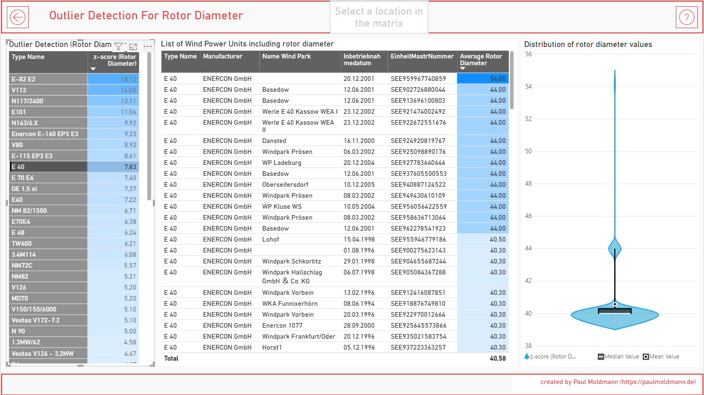

# power_bi
Examples for the design of power bi reports and semantic models

# about me
I am a freelance power bi consultant located in Aachen, Germany (https://paulmoldmann.de).

# motivation
I love Power BI and want to share with others how I do things - just as I have profitted from what other professionals out there have done.

# about the semantic model
I have built a real world example using freely accessible data. Since I work oftentimes within the energy business, I have based the model on data from the german "Marktstammdatenregister" (see https://www.marktstammdatenregister.de/MaStR/Datendownload). It supplies data from all wind (and also solar) power units installed in Germany. For this showcase I have only loaded the wind power units into the model.
In order to build reports based on geographic locations I have also included zip code data from opendatasoft into the model (see https://public.opendatasoft.com/explore/dataset/georef-germany-postleitzahl/information/).

# Sections

In the report wind_power_germany_development you will find a semantic model and report pages that implement the approaches that are described here or are snippeted in the folders found in this repo. So feel free to download the semantic model to find out more.
Features:
- Anomaly / Outlier Detection (see description below)
- deneb visual to compare two measures (see also https://github.com/pmoldmann/deneb_examples/tree/main/Two_Measure_Compare)
- measure slicer (use a slicer to select a measure that is then used on a report page)
- drill through page with action button
- Help Page and navigation using a standard header (that also holds drop down slicers)

Here is a screenshot for the total development of installed capacity in 2024: 

 

## Outlier Detection
To showcase the anomaly / outlier detection I sampled all wind power units grouped by their manufacturers type. Then I am looking for wind power units that have wrong data regarding their rotor diameter. Within one type, the rotor diameter should always be equal (oftentimes the rotor diameter is also somehow included in the type name). Here see a screenshot of the report that shows all type names with outliers (in the table to the left, sorted by their z-score). In the selected type "E 40" the rotor diameter should be 40, but one data point has a value of 54 and some more have a value of 44.  
With this report one can find a list of wind power unit with wrong data regarding their rotor diameter very quickly. 
By the way, the beautiful violine graph (Violine plot) that shows the distribution of rotor diameters has been made by Daniel-Marsh Patrick (https://github.com/dm-p).  

## DAX

### Outlier Detection (max_outlier_zscore.dax)
You might know the problem when working with big semantic models (in my last case > 100M rows in several fact tables) that from time to time, some rows have corrupted data. This data severely minimizes your data quality when aggregating (summing) over these fact tables. 
But... how to find this corrupted data? 
Lately I got tired of seaching again manually and tried out several approaches. 
But the anomaly detection that is built in power bi is too slow and also clumsy to use.
Then I looked in the web for alternative solutions but didn't find any that I really liked. After some more research I came across the z-score (https://en.wikipedia.org/wiki/Standard_score) and implemented this approach as a calculation item in power bi. 
It works like a charm, even for > 100M rows and several dimensions. 

## Powerquery

### Date Dimension (date_dimension.m)
I have derived my own version from the great date table designed by <nolockcz> (https://github.com/nolockcz/PowerQuery/tree/master/Date%20Dimension)

## TMDL

### Time Intellgence measures as calculation group (calculation_group.tmdl)
Here you can find the collection of time intelligence measures that I use as basis in my projects. 